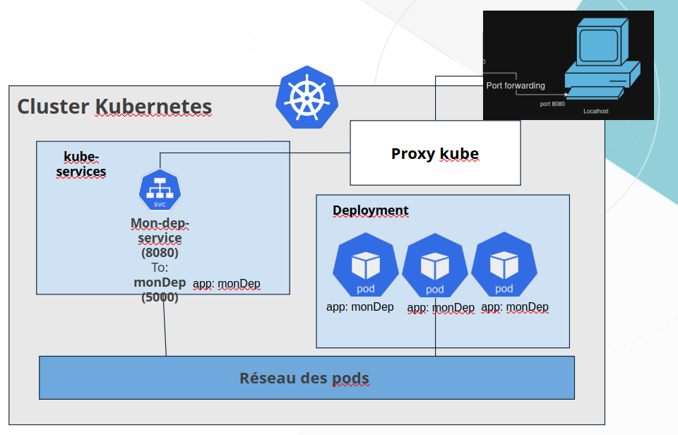

# Quel est le but d'un service ?
Un Service est une ressource kubernetes qui a pour but de donner une adresse IP constante au pod. Le service spécifie ainsi un port sur lequel il ecoute et redirige vers le port du pod en question, donné dans la configuration. 

# Quelle est la différence entre les service ClusterIP et NodePort ?
Les deux sont une solution pour la non stabilité des IP des pods, et donc pour permettre d'accéder au pods. La différence entre les deux se base sur : 
L'ouverture : NodePort peut permettre à la fois d'exposer le port dans le cluster et à l'exterieur du cluster. ClusterIP crée une IP virtuelle et permet uniquement un accés interne. 


```
monkube apply -f dep.yml
monkube get deployments
monkube describe deployment mon-dep
```


# service
```
monkube proxy

http://127.0.0.1:8001/api/v1/namespaces/u-9nl7s/services/mon-dep-service/proxy/

```


